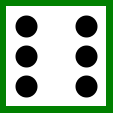
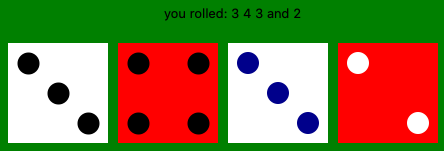
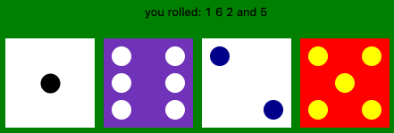
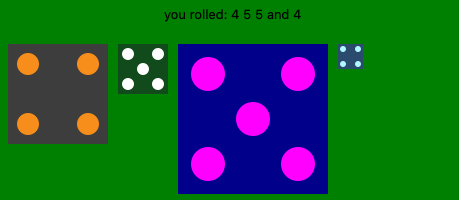

# Dice
Watch thes videos:
- https://www.youtube.com/watch?v=ZDa-Z5JzLYM&t=524s
- https://www.youtube.com/watch?v=BJ-VvGyQxho

Define and implement a class to model a six-sided die that can be rolled and drawn on a canvas. This class can then be used by programs that call for rolling a die.

The brief:

The common die is a six-sided object and each side contains one to six dots. When the die is rolled, one of the six faces ends up on top. This is the value of the die after the roll.

You need to:
- Create a die whose position (x-y coordinates of one on the corners) and size is provided by the user.
- Access the position and size of the die.
- Roll the die.
- Access the value of the face shown on top of the die.
- Set the colour used to draw the die and the colour of the dots (default colours are white and black).
- Draw the die on a canvas.

## Results
I am using the package **tkinter** for creating the canvas and drawing the dice.  
Using the implementation i created you can use the default dice like this:
```python
dice = Dice(canvas)
dice.roll()
print("Value: ", dice.getValue())
```
Which draws the following dice:  
  

and gives as output:
```console
Value: 6
```

But you can customize your dices in any way you like. Here is a few examples:   
   
   

 
