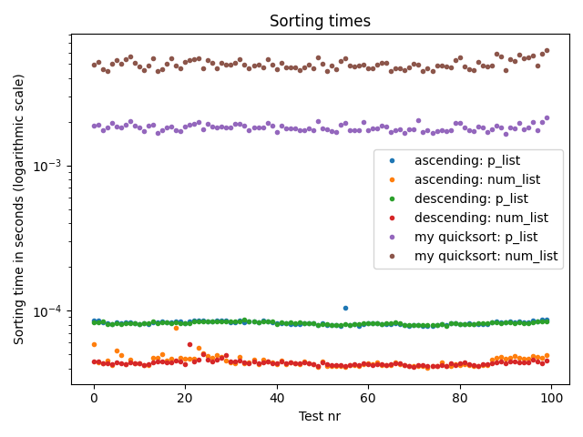
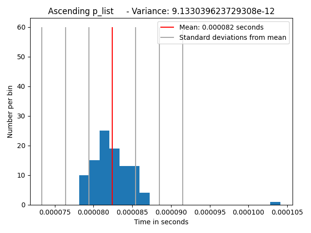
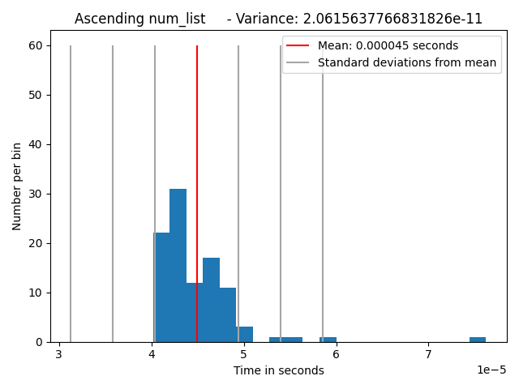
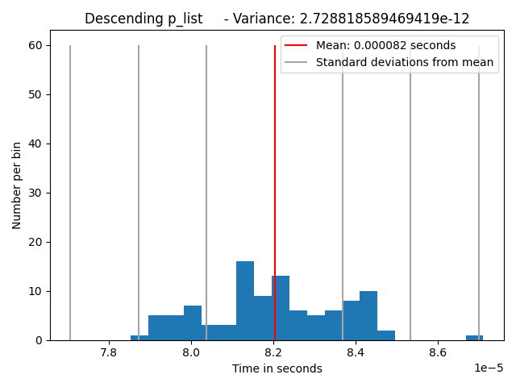
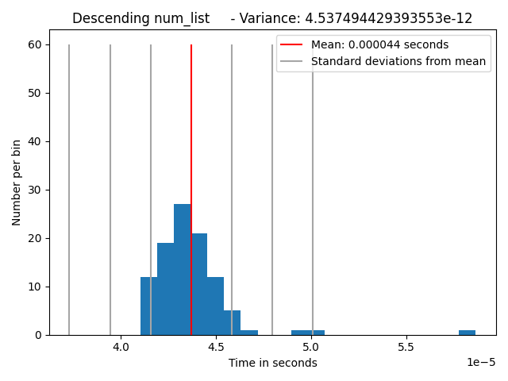
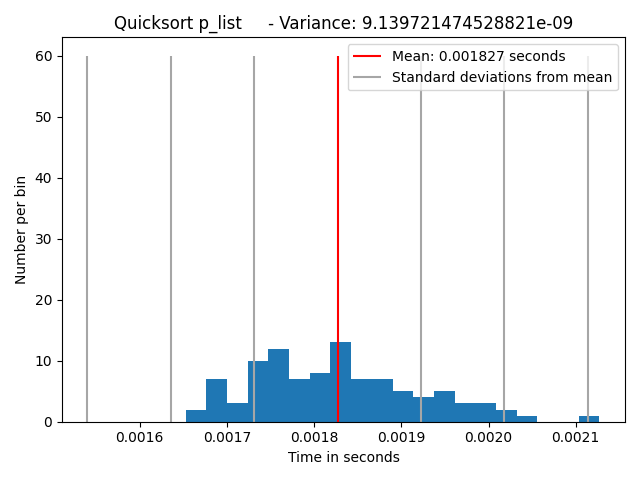
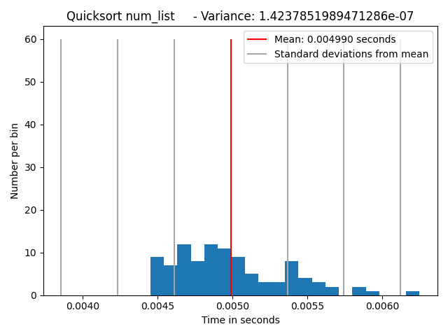

# Exam
Create two lists (one dimensional arrays) of length n=1000 elements.
The first list should be created as a core Python list, p_List.
The second, should be declared as a numpy array num_List.
Populate both lists with identical random floats
(the elements of two lists should be identical p_List[i]=num_List[i] for all i).

Your main tasks are (counts for 60% of the grade):

- Write a Quicksort algorithm (many examples online).
- Write a function that randomizes the order of the values of an input list.
  Specifically, if the input is [1,2,3] then your function should return [2,1,3], [3,2,1] or [3,1,2].
- Perform an ascending and a descending sort on both lists using Python’s own sort method for p_list and numpy’s
  sorting methods for num_List.
- Sort both lists using your Quicksort algorithm from 1.
- Track the sorting times, for each case, using timeit and store them.
- Randomize the lists using the function you wrote in 2. The same order should hold for the Python and
  numpy lists (p’_List[i]=num’_List[i] for all i) .
- Repeat steps 3-6, 100 times.

Visualization tasks (counts for 40% of the grade):

- Plot the execution times recorded at each iteration to compare the speed of Python lists versus numpy using their
  inbuilt sorting methods and your own. You need to plot the time values for ascending and descending in separate
  graphs and consider how to visualise the results.
- Plot the histograms of the running times for the Python list, numpy and your own together with their mean value,
  variance and standard deviation.
- Your plots should have titles and the axes should be labeled.

Time: 3 hours

# Results

## About my results
I didn't have to get the implementation exactly the way i wanted it, if i had more time i would:
- Put all histograms in the same figure using subplots
- Add the variance as a text within the figure instead of the title
- make the mean and standard deviations height be set based on height of the bins
- add labels to the standard deviation lines (+1, +2 etc.)
- convert from seconds to milliseconds for cleaner values
- general polish of code and plots, correcting comments/documentation

